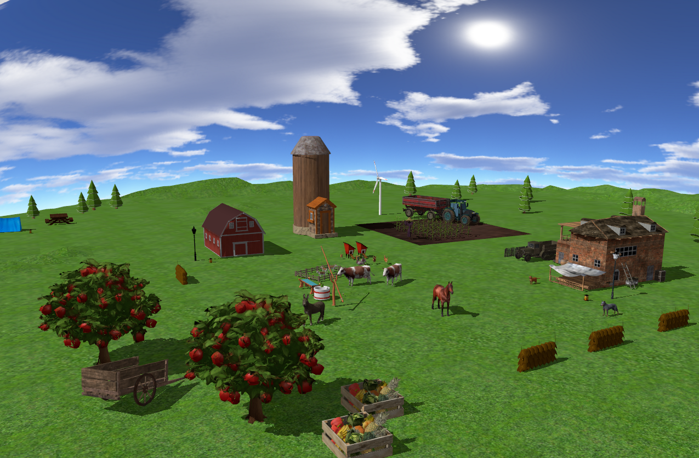

# OpenGL Farm Scene

This project implements a **3D interactive farm environment** using **Modern OpenGL (C++)**.  
The goal of the project was to explore core computer graphics concepts such as lighting, textures, shadows, and user interaction.

The scene represents a **rural environment** with buildings, vegetation, and farm elements that can be explored freely by the user. :contentReference[oaicite:0]{index=0}

## Features

- Free camera navigation using **keyboard and mouse**
- **Day / Night mode** with different lighting conditions
- **Directional lighting** simulating sunlight
- **Point lights** for lanterns in the scene
- **Shadow mapping** for dynamic shadows
- **Fog effect** for depth and atmosphere
- Multiple **rendering modes** (solid, wireframe, point)
- Automatic **scene presentation animation** at startup
- Animated objects (windmill rotation)

## Controls

**Camera**
- `W A S D` – movement
- `Mouse` – camera rotation

**Lighting**
- `N` – toggle day/night
- `L / J` – rotate directional light

**Visual Effects**
- `C` – toggle fog

**Rendering Modes**
- `1` – solid  
- `2` – wireframe  
- `3` – point

## Technologies Used

- **C++**
- **OpenGL**
- **GLFW**
- **GLEW**
- **GLM**
- **Blender** (for creating the 3D models)

## Documentation
Detailed documentation: `FarmDoc.pdf`
